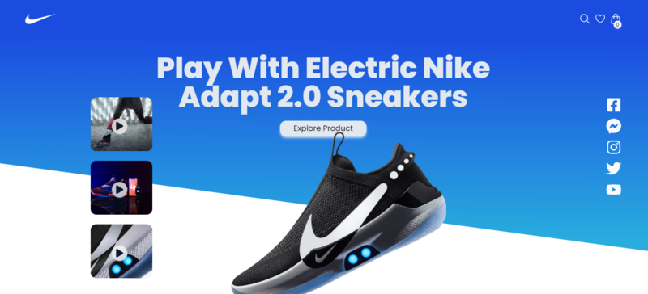
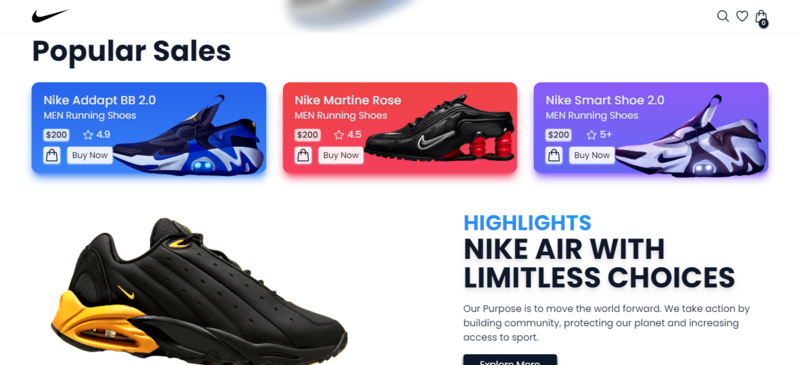

# NIKE STORE

Nike iComer es una aplicación de la tienda en línea que te permite explorar y comprar productos de la reconocida marca Nike. La aplicación está desarrollada utilizando React, TypeScript y Redux Toolkit, lo que garantiza un rendimiento óptimo y una experiencia de usuario fluida.


## Tecnologías principales
 React  
 TypeScript  
 Vite  
 Netlify  
 Tailwind  
 Redux Toolkit  

## Capturas de pantalla
Aquí se muestran las capturas de pantalla de la página web en la versión de escritorio:
 
 


## Empezando

Primero, ejecute el servidor de desarrollo:

```

npm install
# or
yarn instll

# and Now:

npm run dev
# or
yarn dev
```

## Créditos
El proyecto fue creado a partir de un video tutorial de JavaScript Mastery titulado "Build and Deploy Modern Nike Store ECommerce React js Web App | Tailwind Css | Redux Toolkit". Puedes encontrar el video tutorial en [este enlace](https://www.youtube.com/watch?v=QnykUEqAVoc&t=8155s).

## Enlace
Puedes acceder a la página web en el siguiente enlace:
[URL del sitio](https://nice-store2023.netlify.app)

